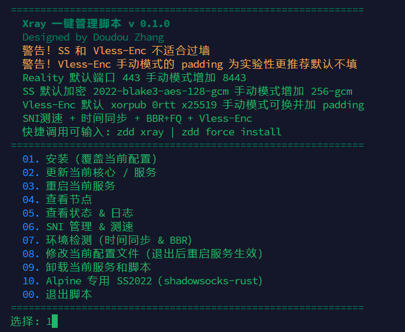
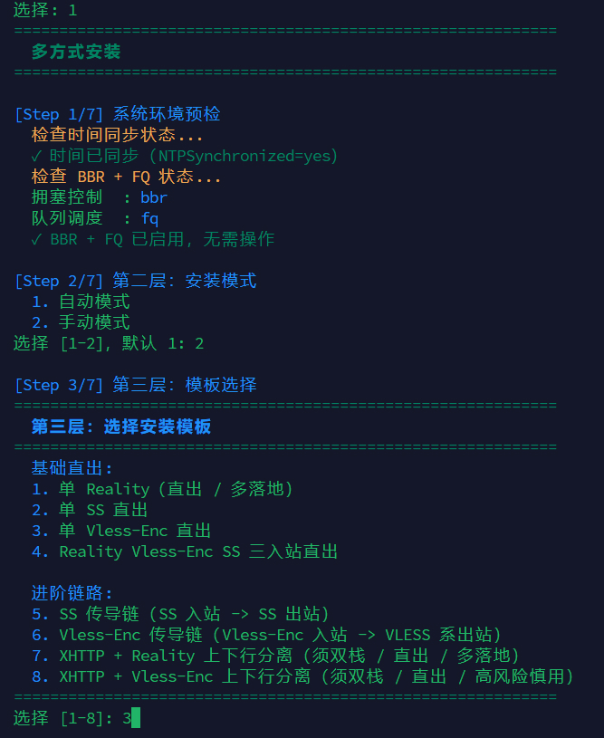
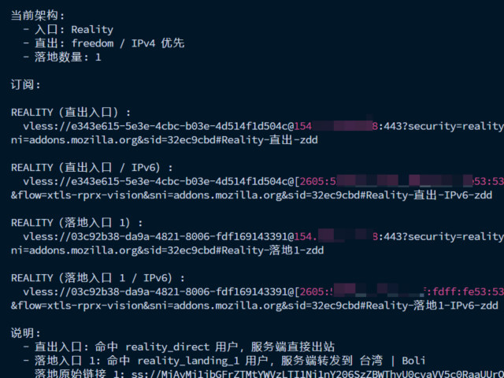
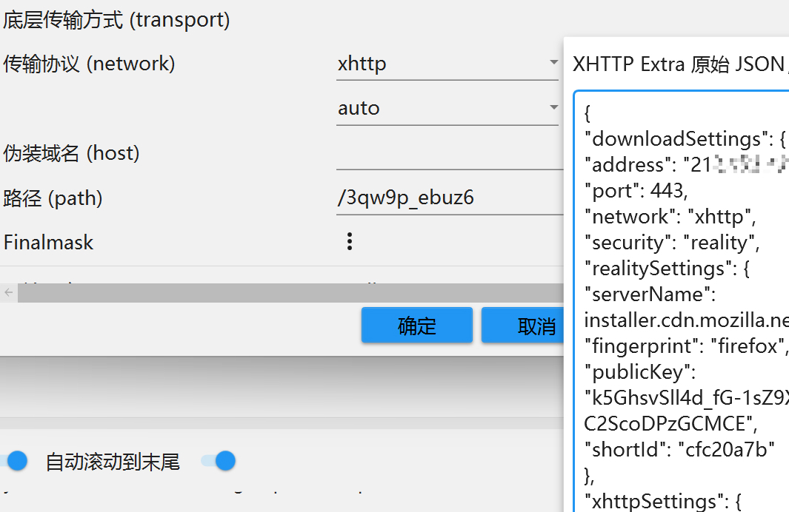

# xray-manager

## 全自动安装 reality，警告：此安装会覆盖原有 xray 配置

### curl

```bash
curl -fsSL -o xray_manager.sh https://raw.githubusercontent.com/WhiteMitty/xray-manager/main/xray-manager.sh && printf '1\n1\n1\n1\n' | bash xray_manager.sh --quick-install
```

### wget

```bash
wget -qO xray_manager.sh https://raw.githubusercontent.com/WhiteMitty/xray-manager/main/xray-manager.sh &&  printf '1\n1\n1\n1\n' | bash xray_manager.sh --quick-install
```

## 常规安装

### curl

```bash
curl -fsSL -o xray-manager.sh https://raw.githubusercontent.com/WhiteMitty/xray-manager/main/xray-manager.sh && bash xray-manager.sh
```

### wget

```bash
wget -qO xray-manager.sh https://raw.githubusercontent.com/WhiteMitty/xray-manager/main/xray-manager.sh && bash xray-manager.sh
```

## 快速调用

```bash
zdd xray
```
<br>

## 注意：仅 1、4、7 号方式中的 reality 适合直连，8号为激进玩法，容易被墙

<br>

<h2 align="left">主界面</h2>
<p align="left">
  
</p>

<h2 align="left">安装界面</h2>
<p align="left">
  
</p>

<h2 align="left">订阅界面</h2>
<p align="left">
  
</p>

## 其他说明

安装代理时若想简单，选择自动

若想进行一些自定义设置，选择手动

若想进行更精细的设置，可用 8 号功能修改

ss2022 和 vless-enc 均不推荐过墙，均有封 ip 风险

vless-enc 的 padding 建议有经验再自行填充，官方默认值足够好

xhttp 只做了基于 v4 v6 的上下行分离，所以刚需双栈小鸡，客户端仅推荐 v2rayN 因为需要填 xhttp extra



## 完整卸载

9 号功能可完整卸载脚本和 xray 及各种配置文件

因为本身带管理运维功能，所以脚本会留在小鸡上，无任何有害代码欢迎审计 ~
