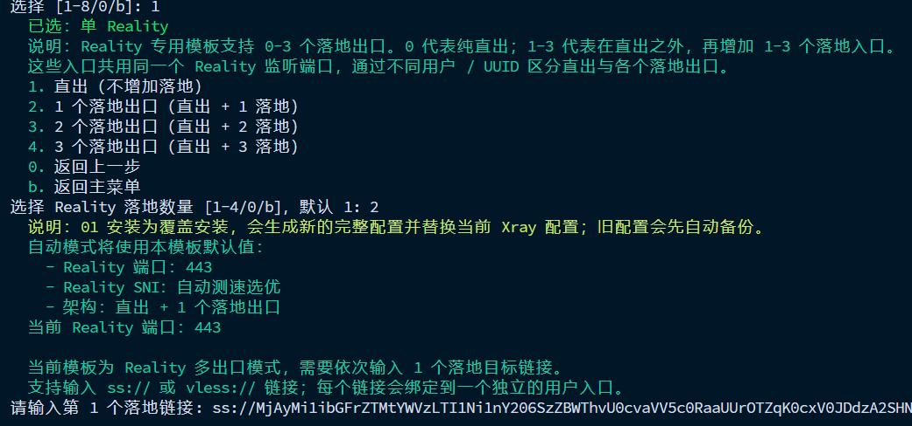
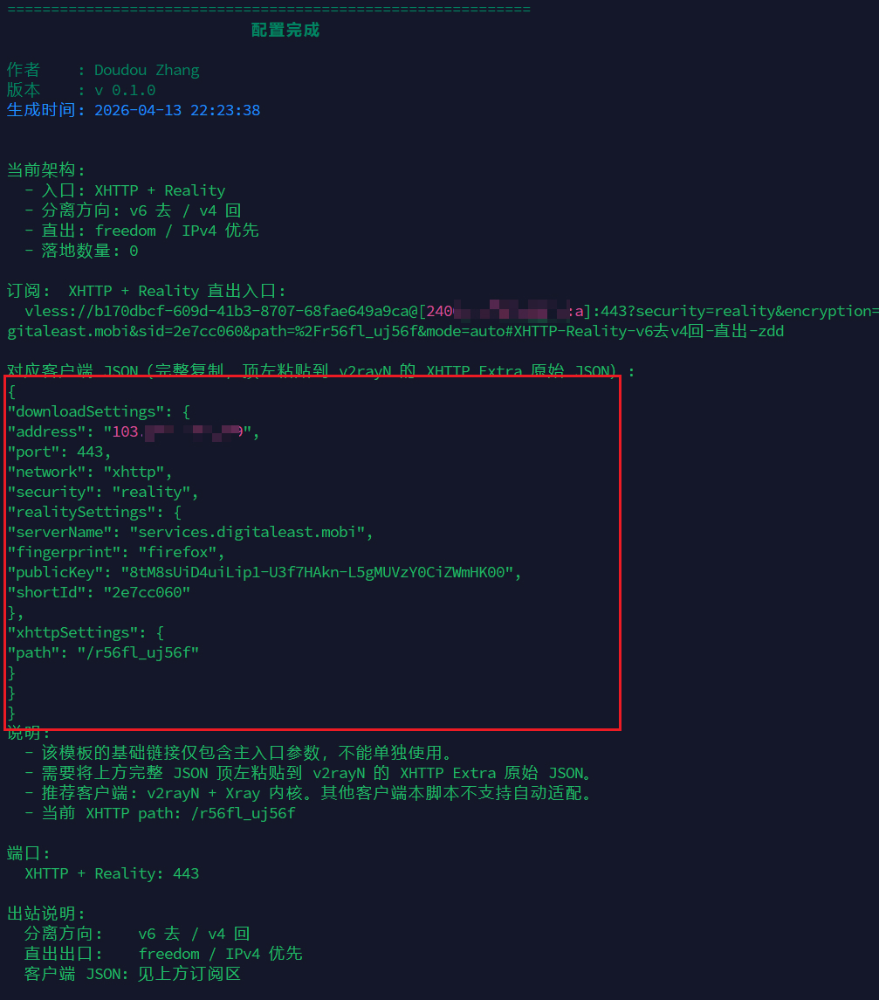
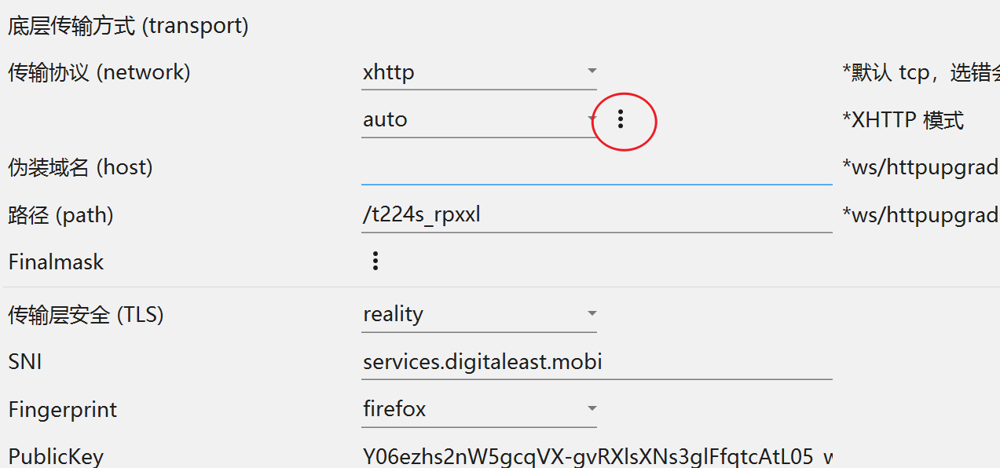
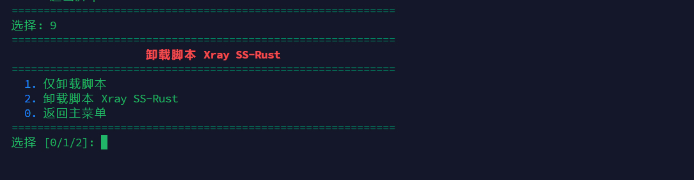

# xray-manager 
## v 0.1.0 2026-04-13 

## 全自动安装 reality，注：安装会覆盖原有 xray 配置，SNI 为个人喜好可能拉胯

## curl

```bash
curl -fsSL -o xray-manager.sh https://raw.githubusercontent.com/WhiteMitty/xray-manager/main/xray-manager.sh && printf '1\n1\n1\n1\n' | bash xray-manager.sh --quick-install
```

## wget

```bash
wget -qO xray-manager.sh https://raw.githubusercontent.com/WhiteMitty/xray-manager/main/xray-manager.sh &&  printf '1\n1\n1\n1\n' | bash xray-manager.sh --quick-install
```
<br>

## 常规安装

## curl

```bash
curl -fsSL -o xray-manager.sh https://raw.githubusercontent.com/WhiteMitty/xray-manager/main/xray-manager.sh && bash xray-manager.sh
```

## wget

```bash
wget -qO xray-manager.sh https://raw.githubusercontent.com/WhiteMitty/xray-manager/main/xray-manager.sh && bash xray-manager.sh
```
<br>

## 启动脚本

```bash
zdd xray
```

## 安装 Reality SS Vless-Enc 三合一

```bash
zdd install
```

## 完整卸载 脚本 Xray SS-Rust 及各种配置

```bash
zdd uinstall
```

<br>

## 注：仅 1、4、7 号方式中的 reality 适合直连，8号为激进玩法，容易被墙
## 注：确保 443、8443 未被占用，防火墙已放行，Reality 写死 443/8443 端口

<br>

<h2 align="left">主界面</h2>
<p align="left">
  
</p>

<h2 align="left">安装界面</h2>
<p align="left">
  
</p>

<h2 align="left">端口复用</h2>
<p align="left">
  
</p>

<h2 align="left">订阅界面</h2>
<p align="left">
  
</p>

<br>

## xhttp 使用

## xhttp 只做了 v4 v6 上下行分离，刚需双栈小鸡，
## 客户端仅推荐 v2rayN 因除订阅还要填 xhttp extra

<br>

## 复制此处 json 


<br>

## 在此处粘贴 


<br>


<br>

## 完整卸载


## 9 号功能可完整卸载脚本和 xray 及各种配置文件

## 因本身带管理运维功能，所以脚本会留在 vps 上，若嫌弃可以选仅删除脚本
